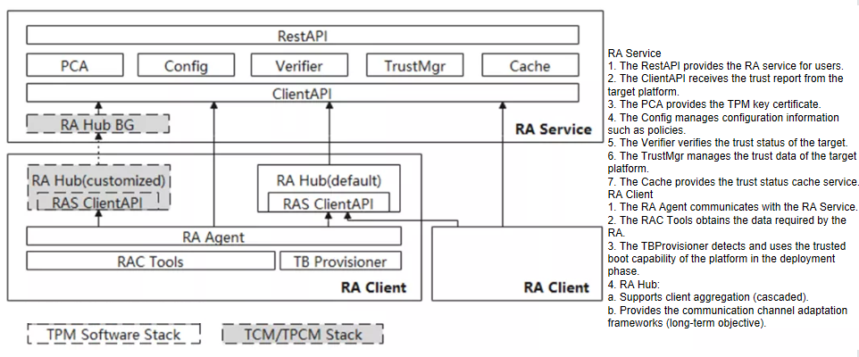

# Kunpeng Security Libraries (kunpengsecl)

#### Description
This project develops basic security software components running on Kunpeng processors. In the early stage, the project focuses on trusted computing fields such as remote attestation to empower security developers in the community.

#### Software architecture
Software architecture description



#### Getting Started

##### Installation based on Ubuntu system
First, you can use the following command to get the latest source code
```
git clone https://gitee.com/openeuler/kunpengsecl.git
```
If you have not installed git tools yet, this command will be helpful
```
sudo apt install git
```

Before the software installation, please execute 
**prepare-build-env.sh** 
in the *kunpengsecl/attestation/quick-scripts/* directory to prepare the necessary build environment.

With regard to the installation of Server *RAS* and the Client *RAC*, you should enter the *kunpengsecl/attestation/ras/* and the *kunpengsecl/attestation/rac/* directory respectively and execute command
```
make install
```
to automatically compile the program and install the corresponding files to the default location

Of course, it will be ok to install *RAS* and *RAC* at the same time with executing command
```
make install
```
in the *kunpengsecl/attestation/* directory

If you need to customize the installation directory, this command
```
make DESTDIR=/xxx/xxx install 'or' make install DESTDIR=/xxx/xxx
```
will be useful

If a compilation error occurs, maybe you can enter the *kunpengsecl/attestation/* directory and execute command
```
make vendor
```
to deal with the error

Unloading methods:

For the uninstallation of *RAS* and *RAC*, you should enter the *kunpengsecl/attestation/ras/* and the *kunpengsecl/attestation/rac/* directory respectively and execute command
```
make uninstall
```
then the files will be automatically cleaned up

By the way, If you have previously customized the installation directory, the format of the uninstall command needs to be changed to 
```
make DESTDIR=/xxx/xxx uninstall 'or' make uninstall DESTDIR=/xxx/xxx
```

##### Installation based on openEuler system
The openEuler system can use **RPM** method to install this program. 
First, you can execute the following command to obtain the latest source code
```
git clone https://gitee.com/openeuler/kunpengsecl.git
```
If you have not installed git tools yet, this command will be helpful
```
sudo yum install git
```

Before the software installation, please execute 
**prepare-build-env.sh** 
in the *kunpengsecl/attestation/quick-scripts/* directory to prepare the necessary build environment.

Also, make sure you have the RPM packaging tool 
**rpmdevtools** 
installed

And then enter the *kunpengsecl/* directory and execute command 
```
make rpm
```
so that you can generate the RPM package of this program

According to actual demand, you can choose to install the corresponding *RAS* or *RAC* RPM package. 
The specific command is as follows:
```
sudo rpm -ivh xxx.rpm
```

Unloading methods:
```
sudo rpm -e xxx
```

#### How To Use

Before running this software, please enter the *kunpengsecl/attestation/quick-scripts/* directory and use 
**prepare-database-env.sh** 
to prepare the necessary database environment

##### Server aspect
Executing ``ras`` in the *kunpengsecl/attestation/ras/cmd/ras/* directory that you can start server. 

Related parameters are as follows: 
```
  -p, --port string   this app service listen at [IP]:PORT
  -r, --rest string   this app rest interface listen at [IP]:PORT
  -T, --token         generate test token and quit
  -v, --verbose       show more detail running information
  -V, --version       show version number and quit
```

##### Client aspect
Executing ``sudo raagent`` in the *kunpengsecl/attestation/rac/cmd/raagent/* directory that you can start client. 

**Note that sudo permission is required to enable the physical TPM module** 

Related parameters are as follows:
```
  -s, --server string   connect attestation server at IP:PORT
  -t, --test            run in test mode[true] or not[false/default]
  -v, --verbose         show more detail running information
  -V, --version         show version number and quit
```

#### Contribution

1.	Fork this repository.
2.	Creating the Feat_xxx branch
3.	Submit your code.
4.	Create a pull request (PR).

#### Gitee Features

1.  Use Readme_XXX.md to mark README files with different languages, such as Readme_en.md and Readme_zh.md.
2.  Gitee blog: [blog.gitee.com](https://blog.gitee.com)
3.  You can visit [https://gitee.com/explore](https://gitee.com/explore) to learn about excellent open source projects on Gitee.
4.  [GVP](https://gitee.com/gvp) is short for Gitee Most Valuable Project.
5.  User manual provided by Gitee: [https://gitee.com/help](https://gitee.com/help)
6.  Gitee Cover People is a column to display Gitee members' demeanor. Visit [https://gitee.com/gitee-stars/](https://gitee.com/gitee-stars/).
