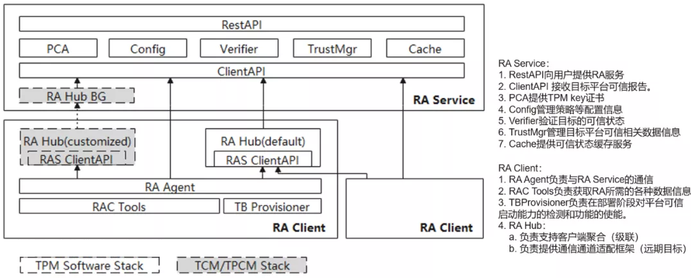

# 鲲鹏安全库(kunpengsecl)

#### 介绍
本项目开发运行在鲲鹏处理器上的基础安全软件组件，先期主要聚焦在远程证明等可信计算相关领域，使能社区安全开发者。

#### 软件架构


#### 安装教程

##### 基于Ubuntu系统的安装

首先，您可使用以下命令获取项目最新源代码
```
git clone https://gitee.com/openeuler/kunpengsecl.git
```
若您尚未安装git工具，可通过
```
sudo apt install git
```
进行安装

软件安装前，请执行kunpengsecl/attestation/quick-scripts/目录下的
**prepare-build-env.sh**
脚本准备必需的编译环境

对于服务器RAS和客户端RAC的安装，分别进入kunpengsecl/attestation/ras/和kunpengsecl/attestation/rac/目录下执行
```
make install
```
命令即可自动编译程序并将相应文件安装到缺省位置

另外也支持在kunpengsecl/attestation/目录下执行
```
make install
```
同时安装RAS和RAC

若您需要自定义安装目录，
```
make DESTDIR=/xxx/xxx install(或make install DESTDIR=/xxx/xxx)
```
的指令将很有效

如果出现编译错误，请在kunpengsecl/attestation/目录下执行
```
make vendor
```
命令

卸载方式：

对于服务器RAS和客户端RAC的卸载，分别进入kunpengsecl/attestation/ras/和kunpengsecl/attestation/rac/目录下执行
```
make uninstall
```
命令即可自动清理安装文件

若您此前自定义了安装目录，那么卸载指令的格式则需要更改为
```
make DESTDIR=/xxx/xxx uninstall(或make uninstall DESTDIR=/xxx/xxx)
```

##### 基于openEuler系统的安装

openEuler系统同样可采用Ubuntu系统的安装方式，除此之外，openEuler系统支持采用rpm的安装方式，首先，您可使用以下命令获取项目最新源代码
```
git clone https://gitee.com/openeuler/kunpengsecl.git
```
或通过以下命令获取项目软件包
```
git clone https://gitee.com/src-openeuler/kunpengsecl.git
```
若您尚未安装git工具，可通过
```
sudo yum install git
```
进行安装

若您安装的是软件包，需要先解压软件包中的**kunpengsecl-vx.x.x.tar.gz**和**vendor.tar.gz**两个压缩文件再进行以下操作

软件安装前，请执行kunpengsecl/attestation/quick-scripts/目录下的
**prepare-build-env.sh**
脚本准备必需的编译环境

另外，请确保您已安装好rpm打包工具
**rpmdevtools**
之后在kunpengsecl/目录下执行
```
make rpm
```
即可生成程序的rpm包

之后，您可根据实际需求，选择安装rac、ras或rahub对应的rpm包，进入kunpengsecl/rpmbuild/RPMS/x86_64目录执行如下安装命令：
```
sudo rpm -ivh xxx.rpm
```
卸载方式：
```
sudo rpm -e xxx
```

#### 使用说明
在运行本软件前，请进入kunpengsecl/attestation/quick-scripts/目录执行
**prepare-database-env.sh**
脚本以准备必需的数据库环境

##### 配置说明
程序运行所依赖的配置文件默认有三个读取路径，分别为当前目录'./config.yaml'，家目录'${HOME}/.config/attestation/ras(rac)(rahub)/config.yaml，以及系统目录'/etc/attestation/ras(rac)(rahub)/config.yaml

为了创建您的家目录配置文件，您可在安装好rpm包后，于kunpengsecl根目录执行位于/usr/share/attestation/ras(rac)(rahub)下的脚本**prepare-ras(rac)(hub)conf-env.sh**，从而自动完成家目录配置文件的部署

##### 服务器配置
于命令行输入
``ras``
即可开启服务器。在服务器目录下需要提供``ECDSA``公钥并命名为``ecdsakey.pub``
相关参数如下：
```
  -H  --https         the https switch, use https[true/default] or http[false]
  -h  --hport         the https rest interface listens at [IP]:PORT
  -p, --port string   this app service listen at [IP]:PORT
  -r, --rest string   this app rest interface listen at [IP]:PORT
  -T, --token         generate test token and quit
  -v, --verbose       show more detail running information
  -V, --version       show version number and quit
```

##### 客户端配置
于命令行输入
``sudo raagent``
即可开启客户端（请注意，物理TPM模块的开启需要sudo权限）。相关参数如下：
```
  -s, --server string   connect attestation server at IP:PORT
  -t, --test            run in test mode[true] or not[false/default]
  -v, --verbose         show more detail running information
  -V, --version         show version number and quit
  -i, --imalog          input ima log path
  -b, --bioslog         input bios log path
```

#### 接口定义
为了便于管理员对目标服务器以及RAS进行管理，本程序设计了以下接口可供调用：
```
/: GET
/{id}: GET、POST、DELETE
/{from}/{to}: GET
/{id}/reports: GET
/{id}/reports/{reportid}: GET、DELETE
/{id}/basevalues: GET
/{id}/newbasevalue: POST
/{id}/basevalues/{basevalueid}: GET、POST、DELETE
/version: GET
/login: GET
/config: GET、POST
/{id}/container/status: GET
/{id}/device/status: GET
```
接下来分别介绍上述接口的具体用法。

若您想要查询所有服务器的信息，那么您可以使用`"/"`接口。
```shell
curl -X GET -H "Content-Type: application/json" http://localhost:40002/
```
若您想要查询目标服务器的详细信息，那么您可以使用`"/{id}"`接口的`GET`方法，其中{id}是RAS为目标服务器分配的唯一标识号。
```shell
curl -X GET -H "Content-Type: application/json" http://localhost:40002/1
```
若您想要修改目标服务器的信息，那么您可以使用`"/{id}"`接口的`POST`方法，其中$AUTHTOKEN是您事先使用`ras -T`自动生成的身份验证码。
```go
type clientInfo struct {
	Registered   *bool `json:"registered"`  // 目标服务器注册状态
	IsAutoUpdate *bool `json:"isautoupdate"`// 目标服务器基准值更新策略
}
```
```shell
curl -X POST -H "Authorization: $AUTHTOKEN" -H "Content-Type: application/json" http://localhost:40002/1 -d '{"registered":false, "isautoupdate":false}'
```
若您想要删除目标服务器，那么您可以使用`"/{id}"`接口的`DELETE`方法，注意：使用该方法并非删除目标服务器的所有信息，而是把目标服务器的注册状态置为`false`！
```shell
curl -X DELETE -H "Authorization: $AUTHTOKEN" -H "Content-Type: application/json" http://localhost:40002/1
```
若您想要查询指定范围内的所有服务器信息，那么您可以使用`"/{from}/{to}"`接口的`GET`方法。
```shell
curl -X GET -H "Content-Type: application/json" http://localhost:40002/1/9
```
若您想要查询目标服务器的所有可信报告，那么您可以使用`"/{id}/reports"`接口的`GET`方法。
```shell
curl -X GET -H "Content-Type: application/json" http://localhost:40002/1/reports
```
若您想要查询目标服务器指定可信报告的详细信息，那么您可以使用`"/{id}/reports/{reportid}"`接口的`GET`方法，其中{reportid}是RAS为目标服务器指定可信报告分配的唯一标识号。
```shell
curl -X GET -H "Content-Type: application/json" http://localhost:40002/1/reports/1
```
若您想要删除目标服务器指定可信报告，那么您可以使用`"/{id}/reports/{reportid}"`接口的`DELETE`方法，注意，使用该方法将删除指定可信报告的所有信息，您将无法再通过接口对该报告进行查询！
```shell
curl -X DELETE -H "Authorization: $AUTHTOKEN" -H "Content-Type: application/json" http://localhost:40002/1/reports/1
```
若您想要查询目标服务器的所有基准值，那么您可以使用`"/{id}/basevalues"`接口的`GET`方法。
```shell
curl -X GET -H "Content-Type: application/json" http://localhost:40002/1/basevalues
```
若您想要给目标服务器新增一条基准值信息，那么您可以使用`"/{id}/newbasevalue"`接口的`POST`方法。
```go
type baseValueJson struct {
	BaseType   string `json:"basetype"`   // 基准值类型
	Uuid       string `json:"uuid"`       // 容器或设备的标识号
	Name       string `json:"name"`       // 基准值名称
	Enabled    bool   `json:"enabled"`    // 基准值是否可用
	Pcr        string `json:"pcr"`        // PCR值
	Bios       string `json:"bios"`       // BIOS值
	Ima        string `json:"ima"`        // IMA值
	IsNewGroup bool   `json:"isnewgroup"` // 是否为一组新的基准值
}
```
```shell
curl -X POST -H "Authorization: $AUTHTOKEN" -H "Content-Type: application/json" http://localhost:40002/1/newbasevalue -d '{"name":"test", "basetype":"host", "enabled":true, "pcr":"testpcr", "bios":"testbios", "ima":"testima", "isnewgroup":true}'
```
若您想要查询目标服务器指定基准值的详细信息，那么您可以使用`"/{id}/basevalues/{basevalueid}"`接口的`GET`方法，其中{basevalueid}是RAS为目标服务器指定基准值分配的唯一标识号。
```shell
curl -X GET -H "Content-Type: application/json" http://localhost:40002/1/basevalues/1
```
若您想要修改目标服务器指定基准值的可用状态，那么您可以使用`"/{id}/basevalues/{basevalueid}"`接口的`POST`方法。
```shell
curl -X POST -H "Content-type: application/json" -H "Authorization: $AUTHTOKEN" http://localhost:40002/1/basevalues/1 -d '{"enabled":true}'
```
若您想要删除目标服务器指定基准值，那么您可以使用`"/{id}/basevalues/{basevalueid}"`接口的`DELETE`方法，注意，使用该方法将删除指定基准值的所有信息，您将无法再通过接口对该基准值进行查询！
```shell
curl -X DELETE -H "Authorization: $AUTHTOKEN" -H "Content-Type: application/json" http://localhost:40002/1/basevalues/1
```
若您想要获取本程序的版本信息，那么您可以使用`"/version"`接口的`GET`方法。
```shell
curl -X GET -H "Content-Type: application/json" http://localhost:40002/version
```
若您想要查询目标服务器/RAS/数据库的配置信息，那么您可以使用`"/config"`接口的`GET`方法。
```shell
curl -X GET -H "Content-Type: application/json" http://localhost:40002/config
```
若您想要修改目标服务器/RAS/数据库的配置信息，那么您可以使用`"/config"`接口的`POST`方法。
```go
type cfgRecord struct {
  // 目标服务器配置
	HBDuration      string `json:"hbduration" form:"hbduration"`
	TrustDuration   string `json:"trustduration" form:"trustduration"`
  DigestAlgorithm string `json:"digestalgorithm" form:"digestalgorithm"`
  // 数据库配置
	DBHost          string `json:"dbhost" form:"dbhost"`
	DBName          string `json:"dbname" form:"dbname"`
	DBPassword      string `json:"dbpassword" form:"dbpassword"`
	DBPort          int    `json:"dbport" form:"dbport"`
	DBUser          string `json:"dbuser" form:"dbuser"`
  // RAS配置
	MgrStrategy     string `json:"mgrstrategy" form:"mgrstrategy"`
	ExtractRules    string `json:"extractrules" form:"extractrules"`
  IsAllupdate     *bool  `json:"isallupdate" form:"isallupdate"`
	LogTestMode     *bool  `json:"logtestmode" form:"logtestmode"`
}
```
```shell
curl -X POST -H "Authorization: $AUTHTOKEN" -H "Content-Type: application/json" http://localhost:40002/config -d '{"hbduration":"5s","trustduration":"20s","DigestAlgorithm":"sha256"}'
```

#### 参与贡献

1.  Fork 本仓库
2.  新建 Feat_xxx 分支
3.  提交代码
4.  新建 Pull Request

