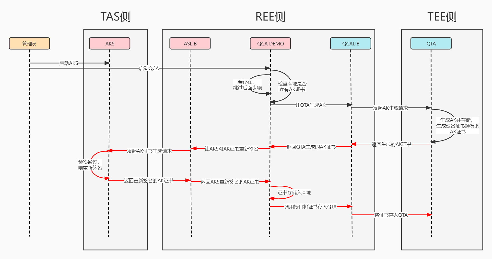

## 整体流程设计

### 方案描述
首先，管理员分别启动AKS、QCA程序，在本业务中，AKS等同于服务端，QCA等同于客户端。开放服务端口地址为`127.0.0.1:40008`

在管理员启动QCA后，QCA会先读取配置文件，检查本地是否存有AK证书，若AK证书已存在，则**终止后续操作**。
QCA端配置文件设计如下：
```yaml
qcaconfig:
  server: 127.0.0.1:40007
  akserver: 127.0.0.1:40008
  scenario: 0
  akcertfile: ./nodaa-ak.crt
  clientid: -1
```
其中，`server`字段表示QCA在与Attester交互时开放的端口地址，`akserver`字段表示与AKS进行交互时连接的端口地址，`scenario`表示程序的应用场景，`akcertfile`表示AK证书的文件路径与文件名，`clientid`表示QCA在AKS端注册后所分配的唯一标识符。
```go
func hasAKCert(s int, path string) bool
```
本函数是AK证书的检查函数，参数s表示程序的应用场景，参数path表示AK证书的搜索路径，返回值为布尔类型，表示AK证书是否存在。

若AK证书不存在，QCA会通过调用QCALIB提供的``RemoteAttestProvision``接口让QTA生成AK以及设备证书颁发的AK证书，然后获取该证书。
```c
TEEC_Result RemoteAttestProvision(uint32_t scenario, struct ra_buffer_data *param_set, struct ra_buffer_data *out_data)
```
获取了设备证书颁发的AK证书后，QCA需要借助ASLIB提供的通讯编程接口``GetAKCert``与AKS进行交互，将AK证书发送给AKS，然后AKS对该证书进行验签并使用自己的私钥重新签名，生成AS颁发的AK证书，再把该证书返回给QCA。
```go
func GetAKCert(oldCert []byte) []byte
```

QCA在接收到AS颁发的AK证书后，先根据配置文件将该证书存储入本地，然后调用QCALIB提供的``RemoteAttestSaveAKCert``接口将该证书存储到TEE侧。至此整个AK生成业务结束。
```c
TEEC_Result RemoteAttestSaveAKCert(struct ra_buffer_data *akcert)
```

### 流程图
