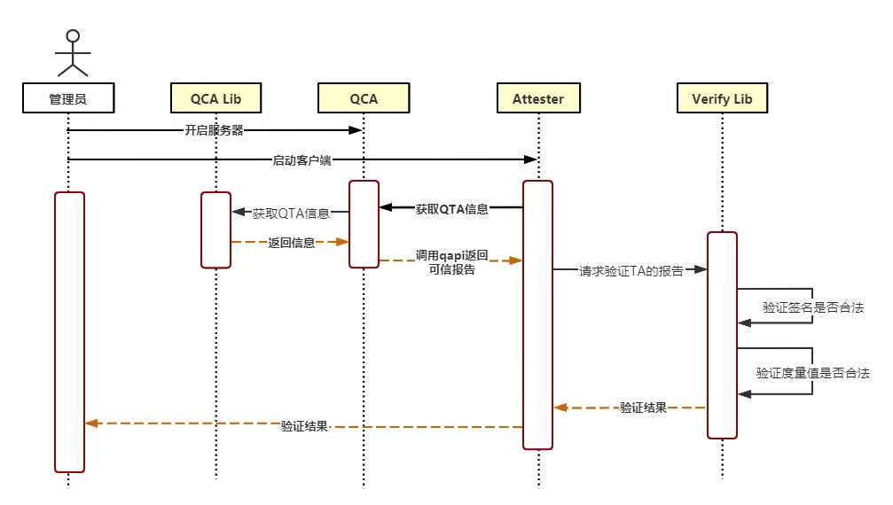
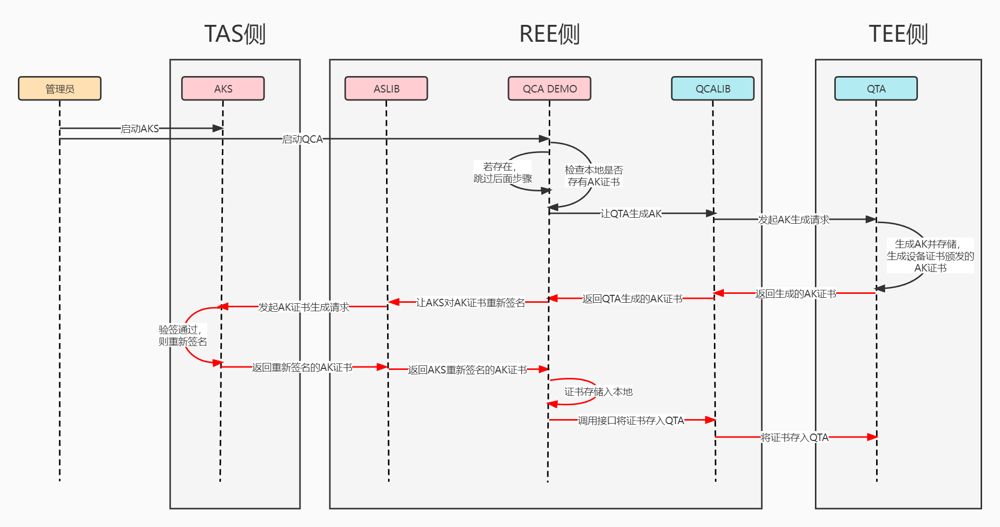
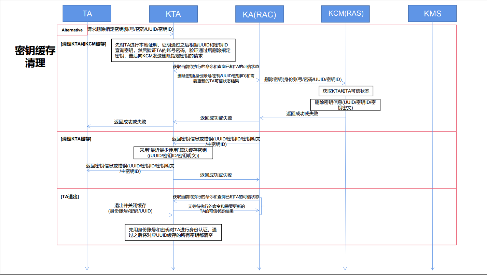

# TEE特性实现

<!-- TOC -->

  - [TEE特性实现](#tee特性实现)
      - [远程证明特性](#远程证明特性)
          - [实体介绍](#实体介绍)
              - [QCA_DEMO介绍](#qca_demo介绍)
              - [ATTESTER_DEMO介绍](#attester_demo介绍)
              - [VERIFIER_LIB介绍](#verifier_lib介绍)
              - [AK_Service介绍](#ak_service介绍)
          - [接口介绍](#接口介绍)
              - [QCA_LIB接口](#qca_lib接口)
              - [ATTESTER_LIB接口](#attester_lib接口)
              - [AK_Service接口](#ak_service接口)
          - [最小实现](#最小实现)
              - [需求概述](#需求概述)
              - [原理图](#原理图)
              - [实体关系图](#实体关系图)
              - [安装部署](#安装部署)
              - [程序启动](#程序启动)
          - [独立实现](#独立实现)
              - [需求概述](#需求概述-1)
              - [原理图](#原理图-1)
              - [安装部署](#安装部署-1)
              - [程序启动](#程序启动-1)
      - [密钥缓存管理特性](#密钥缓存管理特性)
          - [实体介绍](#实体介绍-1)
              - [KTA介绍](#kta介绍)
              - [KA介绍](#ka介绍)
              - [KCMS介绍](#kcms介绍)
          - [数据定义](#数据定义)
              - [KTA关键常量](#kta关键常量)
              - [KTA参数声明](#kta参数声明)
              - [KTA关键数据结构](#kta关键数据结构)
              - [KA关键常量](#ka关键常量)
              - [KA关键数据结构](#ka关键数据结构)
              - [KCMS关键常量](#kcms关键常量)
              - [KCMS关键数据结构](#kcms关键数据结构)
          - [接口描述](#接口描述)
              - [KTA接口](#kta接口)
              - [KA接口](#ka接口)
              - [KCMS接口](#kcms接口)
          - [流程图](#流程图)
              - [密钥缓存初始化](#密钥缓存初始化)
              - [密钥访问鉴权&密钥获取](#密钥访问鉴权密钥获取)
              - [密钥缓存清理](#密钥缓存清理)
              - [本地证明&远程证明](#本地证明远程证明)
              - [KMS支持](#kms支持)

<!-- TOC -->

## 远程证明特性

TEE远程证明是鲲鹏安全生态开源组件鲲鹏安全库的一个重要特性，支撑基于鲲鹏平台构建开源机密计算解决方案。

当数据中心管理工具/管理员、云服务基础设施编排工具、密钥管理中心/模型提供方希望获取目标服务器上TEE中TA的可信状态时，需要触发TEE远程证明特性的功能。

### 实体介绍

#### QCA_DEMO介绍

QCA_DEMO在本方案中担任了服务端的角色，主要功能是本地调用QCA_LIB获取TEE中TA的可信报告，然后通过提供一个接口QAPI与位于其他平台的客户端进行交互，传输可信报告。其下分有main.go、qapi.go、qcatools.go三个模块，各自实现不同的功能。另外，由于QCA_DEMO采用Go语言开发，而QCA_LIB采用C语言开发，所以QCA_DEMO同时还借助CGO机制，提供了将C语言编写的可信报告转换为Go语言编写的可信报告的功能。

#### ATTESTER_DEMO介绍

ATTESTER_DEMO在本方案中担任了客户端的角色，主要功能是将从远程获取的TEE中TA的可信报告，本地调用VERIFIER_LIB进行可信验证，包含身份验证和完整性验证，并向管理员返回验证结果。其下分有main.go、attestertools.go两个模块，各自实现不同的功能。另外，由于ATTESTER_DEMO采用Go语言开发，而VERIFIER_LIB采用C语言开发，所以ATTESTER_DEMO同时还借助CGO机制，提供了将Go语言编写的可信报告转换为C语言编写的可信报告的功能。

#### VERIFIER_LIB介绍

VERIFIER_LIB实现TA完整性策略引擎，帮助ATTESTER_DEMO完成TA完整性判定。其下主要分有teeverifier.c、teeverifier.h、common.h三个文件，其中teeverifier.h是teeverifier.c对应的头文件，定义了可向外部暴露的接口，common.h定义了库所用到的各个常量、数据结构、内部函数等，而teeverifier.c则是对外接口的具体功能实现。

#### AK_Service介绍

AK_Service作为证明密钥服务端，分场景实现对TA的AKey Cert进行数字签名的服务。其中，RestAPI向用户提供信息维护服务，ClientAPI接收目标平台AK生成请求， AK Issuer实现相应协议帮助生成AK，Crypto实现必要的密码算法。

### 接口介绍

#### QCA_LIB接口

**QCA_DEMO**是本程序的服务端，主要提供发送指定TA的可信报告的服务，基于Go语言编写。

该实体底层依赖于**QCA_LIB**提供的接口，主要有：
```c
TEEC_Result RemoteAttestProvision(uint32_t scenario, 
                                    struct ra_buffer_data *param_set, 
                                    struct ra_buffer_data *out_data);
```
接口描述：注册并获取AK公钥和证书  
参数1【传入】：表示不同的业务场景。  
scenario=RA_SCENARIO_NO_AS, 无AS仅有DRK场景  
scenario=RA_SCENARIO_AS_NO_DAA, 有AS但无DAA场景  
scenario=RA_SCENARIO_AS_WITH_DAA, 有AS且有DAA场景  
scenario=其他值，不支持  
参数2【传入】：密码学算法属性，包含两个字段。  
字段一代表选取的哈希算法，目前只支持传入SHA256算法。  
字段二代表选取的DAA公共参数（G1的曲线名），目前仅支持G1的曲线名为“daa_grp_fp256bn”。  
参数3【传出】：输出AK公钥和证书。  
scenario=RA_SCENARIO_NO_AS无出参，out_data.size为0。  
scenario=RA_SCENARIO_AS_NO_DAA有出参，出参结果为CertAK：ts||TAG||AK_pub||SigDRK(ts||TAG||AK_pub)||CertDRK。  
scenario=RA_SCENARIO_AS_WITH_DAA有出参，出参结果为CertAK：ts||TAG||([AKpri]P1)||SigDRK(ts|| ([AKpri]P1)||AK_pub)||CertDRK。  
其中，有AS场景下至少传入4K字节大小的缓冲区。  
***
```c
TEEC_Result RemoteAttestReport(TEEC_UUID ta_uuid,
                               struct ra_buffer_data *usr_data,
                               struct ra_buffer_data *param_set,
                               struct ra_buffer_data *report,
                               bool with_tcb);
```
接口描述：获取证明报告  
参数1【传入】：待证明的TA uuid。  
参数2【传入】：用户传入的挑战数据buffer，包括起始地址和大小，最大64字节。  
参数3【传入】：密码学算法属性，结构同provision的入参，包含三个字段。  
字段一表示哈希算法  
字段二表示DAA下的basename  
字段三表示with_tcb，是否关联软件可信基度量值  
参数4【传出】：用户预分配存放证明报告的缓冲区buffer，包括起始地址和大小，至少传入8K字节大小。  
传出report格式：  
原report的明文数据 || DAA签名 || AK证书  
DAA签名：size || J || size || K || size || h2 || size || s || size || nm  
AK证书：size || AKCert.A || size || AKCert.B || size || AKCert.C || size || AKCert.D  
参数5【传入】：是否关联软件可信基度量值，目前只能是false。  
***
```c
TEEC_Result RemoteAttestSaveAKCert(struct ra_buffer_data *akcert);
```
接口描述：存储AK Service认证机构颁发的AK证书到TEE安全存储里  
参数1【传入】：akcert缓冲区：存放AK证书的buffer起始地址和大小，最大传入8K字节。  
buffer的格式：size (ciper1) || ciper1 || tag || iv || size (ciper2) || ciper2
  - 每个size均为uint32_t大小
  - Cipher2是会话密钥K对AK证书及零知识证明结果的加密密文，明文为：
    - size || AKCert.A || size || AKCert.B || size || AKCert.C || size || AKCert.D || size || u || size || j
  - Cipher2加密算法为AES-GCM，key为256bit，有tag与iv需放置在最前面
    - Tag固定长度：16字节 密文的最后16字节
    - Iv固定长度：12字节 nonce
  - Cipher1是DRK公钥对AK公钥（Qs）及会话密钥K的加密密文，明文为：
    - Size || Qs || size || K
  - Cipher1加密算法为RSA4096公钥加密，padding方式为：
    - TEE_ALG_RSAES_PKCS1_OAEP_MGF1_SHA256
***
由于**QCA_LIB**是以C语言编写的，因此DEMO程序需要基于CGO机制实现对C接口的调用，示例如下：
```go
/*
#cgo CFLAGS: -I${BUILD_DIR}
#cgo LDFLAGS: -L${LINK1_DIR} -lqca -Wl,-rpath=${LINK2_DIR}
#include "teeqca.h"
*/
import "C"
```
其中${BUILD_DIR}是指我们的tee verifier库对应头文件的检索路径，这里可以用相对路径

而${LINK1_DIR}是指我们的DEMO程序在**编译**时对动态链接库.so文件的检索路径，这里必须用绝对路径，-lqca说明我们要链接的动态库名称为libqca.so

需要注意的是，${LINK2_DIR}是指我们的DEMO程序在**执行**时对动态链接库.so文件的检索路径，这里也可以用相对路径

***
另外，由于**QCA_LIB**的开发尚未与本项目进行整合，因此我们暂时模拟了一个**QCA_LIB**的实现，其代码放于tee/tverlib/simulator/目录下，相应的DEMO程序代码中对**QCA_LIB**的调用路径也为该目录，进行的是模拟测试，当后期我们与**QCA_LIB**完成整合后，仅需修改以上三个路径变量，即可实现真实的环境测试
***

#### ATTESTER_LIB接口

**ATTESTER_DEMO**是本程序的客户端，主要是接收从**QCA_DEMO**处发送过来的可信报告，然后调用**VERIFIER_LIB**提供的接口进行可信验证，返回验证结果给用户，同样基于Go语言编写。

该实体底层依赖于**VERIFIER_LIB**提供的接口，主要有：
```c
int tee_verify_report(buffer_data *data_buf,buffer_data *nonce,int type, char *filename);
```
接口描述：对可信报告进行身份验证和完整性验证  
参数1：可信报告缓冲区指针，即通过事先调用QCA_LIB中RemoteAttestReport函数所更新的report参数  
参数2：用户提供的一个随机数，需要与可信报告中指定位置的nonce值进行比对，用于防重放攻击  
参数3：验证类型，即度量策略，1为仅比对img-hash值，2为仅比对hash值，3为同时比对img-hash和hash两个值  
参数4：基准值文件路径，可从该文件中读取基准值与可信报告中的度量值进行比对  
返回值：验证结果（0或-1或-2或-3）  
相应的返回值定义如下：
```c
enum error_status_code {
    TVS_ALL_SUCCESSED = 0, // 可信验证通过
    TVS_VERIFIED_NONCE_FAILED = -1, // nonce值不一致
    TVS_VERIFIED_SIGNATURE_FAILED = -2, // 签名或证书验证失败
    TVS_VERIFIED_HASH_FAILED = -3, // 度量值验证失败
};
```
***
本接口内部由以下三个函数实现对应功能：
```c
bool tee_verify_nonce(buffer_data *buf_data,buffer_data *nonce);
```
接口描述：验证可信报告中的nonce值是否与用户生成的一致  
参数1：可信报告缓冲区指针，即通过事先调用QCA_LIB中RemoteAttestReport函数所更新的report参数  
参数2：用户提供的nonce值缓冲区指针  
返回值：验证结果（true or false）  
***
```c
bool tee_verify_signature(buffer_data *report);
```
接口描述：验证报告签名和证书有效性，例如使用DRK证书对签名数据进行验签(noas)  
参数1：可信报告缓冲区指针，即通过事先调用QCA_LIB中RemoteAttestReport函数所更新的report参数  
返回值：验证结果（true or false）  

**ak_cert对应的固定字段、属性字段和数据字段：**

注：如果为noas情况，需要将akcert转换成如下的数据类型，从中获取到对应的ak_pub、sign_drk以及cert_drk等数据
```c
#define KEY_PURPOSE_SIZE 32
struct ak_cert
{
    uint32_t version;
    uint64_t ts;
    char purpose[KEY_PURPOSE_SIZE];
    uint32_t param_count;
    struct ra_params params[0];
    /* following buffer data:
     * (1)qta_img_hash []
     * (2)qta_mem_hash []
     * (3)reserverd []
     * (4)ak_pub []
     * (5)sign_drk []
     * (6)cert_drk []
     */
} __attribute__((__packed__));
```

**验证过程：**
1. 通过传入的缓冲区类型的report解析出对应的结构体类型的报告
2. 使用DRK证书对sign_drk进行验签（noas情况）
3. 从akcert中获取akpub对sign_ak进行验签
4. 返回验签结果
***
```c
bool tee_verify(buffer_data *buf_data, int type, char *filename);
```
接口描述：验证报告hash值  
参数1：可信报告缓冲区指针，即事先通过调用QCA_LIB中RemoteAttestReport函数所更新的report参数  
参数2：验证类型，即度量策略，1为仅比对img-hash值，2为仅比对hash值，3为同时比对img-hash和hash两个值  
参数3：基准值文件路径，可从该文件中读取基准值与可信报告中的度量值进行比对  

上述**基准值文件**的**格式要求**：

basevalue文件以十六进制字符串的形式存储基准值记录

每一条basevalue记录分为三项：uuid、image-hash、hash，项与项之间用空格间隔，记录之间用换行间隔

| column | uuid(xxxxxxxx-xxxx-xxxx-xxxx-xxxxxxxxxxxx) | img-hash | hash |
| --- | --- | --- | --- |
| digit |  (8-4-4-4-12) | 64 | 64 |
| content（e.g.） | B0019DC2-13CD-5A40-99F9-06343DFBE691 | FB4C924ECCE3D00021C97D7FE815F9400AFF90FB84D8A92651CDE3CA2AEB60B1 | 09972A4984CC521651B683B5C85DD9012104A9A57B165B3E26A7A237B7951AD0 |

返回值：验证结果（true or false）
***

>注意：本接口所需入参中验证类型和基准值文件路径都可通过启动客户端时所键入的命令行参数来进行自定义设置

由于**VERIFIER_LIB**是以C语言编写的，因此DEMO程序需要基于CGO机制实现对C接口的调用。

#### AK_Service接口

AK_Service作为签发AK证书的服务端，通过ClientAPI与QCA进行交互。主要提供的接口为：
```go
func DoGetAKCert(addr string, in *GetAKCertRequest) (*GetAKCertReply, error);
```
接口描述：请求AK_Service对AK证书进行数字签名并返回签名后的证书  
参数1：目标AK_Service服务器的IP:Port地址。  
参数2：请求体，包含原始AK证书的[]byte值和应用场景int32值。  
返回值1：响应体，由AK_Service重新签名的AK证书[]byte值。  
返回值2：错误输出。  

>注：目前AK_Service支持的应用场景分为NoDAA场景RA_SCENARIO_AS_NO_DAA（1）和DAA场景RA_SCENARIO_AS_WITH_DAA（2），分别由不同的函数接口进行实现。

**NoDAA场景接口：**
```go
func GenerateNoDAAAKCert(oldAKCert []byte) ([]byte, error);
```
接口描述：请求AK_Service返回NoDAA场景下重新签名的AK证书  
参数1：原始AK证书的[]byte值。  
返回值1：由AK_Service以NoDAA方式重新签名的AK证书[]byte值。  
返回值2：错误输出。  

**DAA场景接口：**
```go
func GenerateDAAAKCert(oldAKCert []byte) ([]byte, error);
```
接口描述：请求AK_Service返回DAA场景下重新签名的AK证书  
参数1：原始AK证书的[]byte值。  
返回值1：由AK_Service以DAA方式重新签名的AK证书[]byte值。  
返回值2：错误输出。  

### 最小实现

#### 需求概述

用户可基于TEE Verifier Lib和QCA Lib（由华为对外发布）自行编写TEE Attester来验证TEE中用户TA的完整性，使用TEE自生成的AK。

#### 原理图


具体流程如下：

1. 管理员开启服务端。在本方案中服务端是指QCA_DEMO，主要是向客户端提供获取并传输TEE中TA的可信报告的服务；

2. 管理员启动客户端。在本方案中客户端是指ATTESTER_DEMO，管理员可通过指定待验证的TA，设置度量策略、基准值，生成nonce防重放等配置必需的信息入config.yaml文件从而准备好完成验证所必需的条件；

3. ATTESTER_DEMO远程调用QCA_DEMO提供的接口（QAPI）发出获取QTA可信报告的请求，QCA_DEMO在收到请求后，调用QCA_LIB获取QTA的可信报告，再通过QAPI发送给ATTESTER_DEMO，此时可信报告的获取过程结束；

4. ATTESTER_DEMO在收到QCA_DEMO传输回来的可信报告后，将本地调用VERIFIER_LIB提供的可信报告验证接口完成整个验证过程。这一过程主要分为两步，首先是验证nonce、签名、证书等信息，确定生成可信报告的实体身份是否合法，然后根据预先设置的基准值和度量策略，验证可信报告中的度量值是否完整未经篡改，此时可信报告的验证过程结束；

5. 管理员收到ATTESTER_DEMO返回的验证结果，可根据该结果确定TEE中相应的TA是否可信；

#### 实体关系图


#### 安装部署

本程序开发应用于openEuler系统

首先，使用以下命令获取项目最新源代码
```bash
$ git clone https://gitee.com/openeuler/kunpengsecl.git
```

若系统尚未安装 `git` 工具，请先进行安装
```bash
$ sudo yum install git
```

执行**quick-scripts**目录下的 `prepare-build-env.sh` 脚本准备基本编译环境
```bash
$ cd kunpengsecl/attestation/quick-scripts
$ bash prepare-build-env.sh
```

接着，进入**tee**目录进行编译
```bash
$ cd kunpengsecl/attestation/tee
$ make build
```

>请注意：示例中使用 `cd` 命令的起始位置皆为程序根目录（kunpengsecl）的上一级目录！

**关于目录结构的说明**

在**tee**目录下又分为**demo**和**tverlib**两个子目录，TEE远程证明的功能实现由**tverlib**下的代码完成，主要包括基于C语言编写的库文件，可以实现对指定可信应用的身份验证和完整性验证；而**demo**目录下是一个测试程序，可通过该程序查看验证流程。

**关于自行实现attester的编译说明**

若用户需要自行实现一个DEMO程序调用TEE远程证明的动态库，可对VERIFIER_LIB进行单独编译
```bash
$ cd kunpengsecl/attestation/tee/tverlib/verifier
$ make build
```

编译后生成libteeverifier.so动态库文件，并存放在**verifier**目录下，另外，该目录也存放着用户可能用到的头文件。

#### 程序启动

**对于服务端QCA的启用**
```bash
$ cd kunpengsecl/attestation/tee/demo/qca_demo/cmd
$ go run main.go
```
读取 `config.yaml` 中保存的缺省配置开放服务端口。

另外，本程序也支持用户通过命令行键入参数的形式自定义配置，如设置程序的应用场景、指定开放的服务器地址/端口，详细的命令行参数如下：
```
  -C, --scenario int    设置程序的应用场景
  -S, --server string   指定开放的服务器地址/端口
```

**对于客户端ATTESTER的启用**
```bash
$ cd kunpengsecl/attestation/tee/demo/attester_demo/cmd
$ go run main.go -T
```
读取 `config.yaml` 中保存的缺省配置实现可信验证。

>注意：这里必须加`-T`或`--test`参数，因为目前的QCA_LIB为模拟实现，传送过来的是硬编码的可信报告，若不固定nonce值，则验证必然出错！

另外，本程序也支持用户通过命令行键入参数的形式自定义配置，如指定可信应用的UUID、设置基准值文件读取路径、设置度量策略等，详细的命令行参数如下：
```
  -B, --basevalue string   设置基准值文件读取路径
  -M, --mspolicy int       设置度量策略（1为仅比对img-hash值，2为仅比对hash值，3为同时比对img-hash和hash两个值）
  -S, --server string      指定待连接的服务器地址
  -U, --uuid int           指定待验证的可信应用
  -V, --version            打印程序版本并退出
  -T, --test               读取固定的nonce值以匹配目前硬编码的可信报告
```

### 独立实现

#### <a id="需求概述-1"></a>需求概述

用户可基于TEE Verifier Lib和QCA Lib（由华为对外发布）自行编写TEE Attester来验证TEE中用户TA的完整性，使用TEE AK Service生成AK。

#### <a id="原理图-1"></a>原理图


#### <a id="安装部署-1"></a>安装部署

TEE远程证明独立实现的安装部署同<a href="#安装部署">最小实现</a>。

#### <a id="程序启动-1"></a>程序启动

**1. No-DAA 场景**
**对于证明密钥服务端AK_Service的启用**

要启用AKS服务，需要先为AKS配置好私钥和证书。

```bash
$ cd kunpengsecl/attestation/tas/cmd
$ openssl genrsa -out aspriv.key 4096
$ openssl req -new -x509 -days 365 -key aspriv.key -out ascert.crt
$ go run main.go
```
读取 `config.yaml` 中保存的缺省配置开放服务端口，加载设备证书和根证书，配置DAA密钥等。

**对于服务端QCA的启用**
```bash
$ cd kunpengsecl/attestation/tee/demo/qca_demo/cmd
$ go run main.go -C 1
```
读取 `config.yaml` 中保存的缺省配置开放服务端口。

**对于ATTESTER的启用**

同<a href="#程序启动">最小实现</a>。

>注：在有AK_Service环境中，为提高QCA配置证书的效率，并非每一次启动都需要访问AK_Service以生成相应证书，而是通过证书的本地化存储，即读取QCA侧 `config.yaml` 中配置的证书路径，通过 `func hasAKCert(s int) bool` 函数检查是否已有AK_Service签发的证书保存于本地，若成功读取证书，则无需访问AK_Service，若读取证书失败，则需要访问AK_Service，并将AK_Service返回的证书保存于本地。

**2. DAA 场景**
**对于证明密钥服务端AK_Service的启用**

要启用AKS服务，需要先为AKS配置好私钥。

```bash
$ cd kunpengsecl/attestation/tas/cmd
$ vim config.yaml
 # 如下DAA_GRP_KEY_SK_X和DAA_GRP_KEY_SK_Y的值仅用于测试，正常使用前请务必更新其内容以保证安全。
tasconfig:
  port: 127.0.0.1:40008
  rest: 127.0.0.1:40009
  akskeycertfile: ./ascert.crt
  aksprivkeyfile: ./aspriv.key
  huaweiitcafile: ./Huawei IT Product CA.pem
  DAA_GRP_KEY_SK_X: 65A9BF91AC8832379FF04DD2C6DEF16D48A56BE244F6E19274E97881A776543C
  DAA_GRP_KEY_SK_Y: 126F74258BB0CECA2AE7522C51825F980549EC1EF24F81D189D17E38F1773B56
$ go run main.go
```
读取 `config.yaml` 中保存的缺省配置开放服务端口，加载设备证书和根证书，配置DAA密钥等。

**对于服务端QCA的启用**
```bash
$ cd kunpengsecl/attestation/tee/demo/qca_demo/cmd
$ go run main.go -C 2
```
读取 `config.yaml` 中保存的缺省配置开放服务端口。

**对于ATTESTER的启用**

同<a href="#程序启动">最小实现</a>。

>注：在有AK_Service环境中，为提高QCA配置证书的效率，并非每一次启动都需要访问AK_Service以生成相应证书，而是通过证书的本地化存储，即读取QCA侧 `config.yaml` 中配置的证书路径，通过 `func hasAKCert(s int) bool` 函数检查是否已有AK_Service签发的证书保存于本地，若成功读取证书，则无需访问AK_Service，若读取证书失败，则需要访问AK_Service，并将AK_Service返回的证书保存于本地。


## 密钥缓存管理特性

TEE密钥缓存管理是基于TEE远程证明的一个应用扩展特性，尝试将平台的可信和TEE的可信应用到实际的应用场景中。  
当用户TA希望获取KMS中指定密钥时， 需要触发TEE密钥缓存管理特性的功能。  
用户TA需要使用KMS中指定密钥时，可通过集成在鲲鹏安全库中的密钥管理TA，密钥代理，以及密钥管理模块提供的基于远程证明加固的方式安全获取密钥，并在TEE内进行安全的密钥缓存，减少密钥泄露风险。  

### <a id="实体介绍-1"></a>实体介绍

#### KTA介绍

KTA(Key Caching Trusted Application)提供TKML所需的跨TA接口，在授予用户TA指定密钥访问权限前通过本地证明验证用户TA的完整性，根据给定密钥标识管理其缓存状态（加密缓存），使用用户TA给定的封装密钥来封装返回所需密钥。

#### KA介绍

KA在本方案中担任了中间件的角色，KA负责帮助KTA进行初始化，并对KTA中请求队列进行定期轮询，判断KTA中是否有密钥相关请求。KA通过CGO调用KTALIB中的功能，以满足KCMS侧与KTA之间的信息交互。KA部分的开发包含由Go语言开发的katools模块以及由C语言开发的ktalib模块。KTALIB在本方案中担任库的角色，主要用于满足KA对KTA的调用，在TEE视角中KA属于一个CA，而KTALIB则属于类似于TEE内部的QCALIB，符合TEE的开发和要求，在使用TEE内部提供的唯一接口TEEC_InvokeCommand基础之上，在该lib库中实现对指定TA的调用过程，并实现了对TEE内部的函数调用。该lib库使用C语言进行开发，具备KTA初始化过程、KTA命令获取等过程。

#### KCMS介绍

KCMS(Key Caching Management Service)向外支持对接KMIP兼容KMS服务，向内提供密钥安全缓冲协议接口。KCMS中的KeyMgr需要具备借助TEE远程证明特性验证KTA完整性的能力，也可支持用户TA完整性验证。

### 数据定义

#### KTA关键常量

```c
#define MAX_TA_NUM          16      // TA最大数量
#define MAX_KEY_NUM         16      // 密钥最大数量
#define MAX_STR_LEN         64      // 字符串最大长度
#define KEY_SIZE            128     // 密钥大小
#define MAX_QUEUE_SIZE      16      // 队列大小
#define MAX_DATA_LEN        1024    // 数据最大长度
#define PARAM_COUNT         4       // 指令接口所使用的参数数量
```

#### KTA参数声明

1、描述：KTA初始化
```C
cmd CMD_KTA_INITIALIZE
param_type = TEE_PARAM_TYPES(
        TEE_PARAM_TYPE_MEMREF_INPUT,   //存放KCM公钥
        TEE_PARAM_TYPE_MEMREF_INPUT,   //存放KTA公钥证书
        TEE_PARAM_TYPE_MEMREF_INPUT,   //存放KTA私钥
        TEE_PARAM_TYPE_VALUE_OUTPUT    //存放KTA公钥证书（返回）
        );
```

2、描述：KTA请求函数
```C
cmd CMD_SEND_REQUEST
param_type = TEE_PARAM_TYPES(
        TEE_PARAM_TYPE_MEMREF_OUTPUT, //存放请求
        TEE_PARAM_TYPE_NONE,
        TEE_PARAM_TYPE_NONE,
        TEE_PARAM_TYPE_NONE
        );
```

3、描述：KA请求返回
```C
cmd CMD_RESPOND_REQUEST
param_type = TEE_PARAM_TYPES(
        TEE_PARAM_TYPE_MEMREF_INPUT, //存放请求结果
        TEE_PARAM_TYPE_VALUE_OUTPUT, //存放KTA处理结果
        TEE_PARAM_TYPE_NONE,
        TEE_PARAM_TYPE_NONE
        );
```

4、描述：TA请求生成密钥
```C
cmd CMD_TA_GENERATE
param_type = TEE_PARAM_TYPES(
        TEE_PARAM_TYPE_MEMREF_INPUT,  //存放cmd结构体
        TEE_PARAM_TYPE_NONE,
        TEE_PARAM_TYPE_VALUE_OUTPUT,  //存放是否需要向kcm生成请求：固定为1（需要）
                                      //b为0表示生成请求结果失败，1表示生成请求结果成功（详见数据结构TEE_Param）
        TEE_PARAM_TYPE_NONE
        );
```

5、描述：TA请求查询密钥
```C
cmd CMD_KEY_SEARCH
param_type = TEE_PARAM_TYPES(
        TEE_PARAM_TYPE_MEMREF_INPUT,  //存放cmd结构体
        TEE_PARAM_TYPE_MEMREF_OUTPUT, //存放返回密钥明文
        TEE_PARAM_TYPE_VALUE_OUTPUT,  //存放是否需要向kcm生成请求：a为0表示不需要向kcm生成请求，1表示需要向kcm生成请求
                                      //b为0表示生成请求结果失败，1表示生成请求结果成功（详见数据结构TEE_Param）
        TEE_PARAM_TYPE_NONE
        );
```

6、描述：TA请求删除密钥缓存
```C
cmd CMD_KEY_DELETE
param_type = TEE_PARAM_TYPES(
        TEE_PARAM_TYPE_MEMREF_INPUT, //存放cmd结构体
        TEE_PARAM_TYPE_VALUE_OUTPUT, //返回删除结果
        TEE_PARAM_TYPE_VALUE_OUTPUT, //存放是否需要向kcm生成请求：固定为0（不需要）
        TEE_PARAM_TYPE_NONE
        );
```

7、描述：KTA向TA返回结果
```C
cmd CMD_KCM_REPLY
param_type = TEE_PARAM_TYPES(
        TEE_PARAM_TYPE_MEMREF_INPUT,  //存放cmd结构体
        TEE_PARAM_TYPE_MEMREF_OUTPUT, //返回请求结果
        TEE_PARAM_TYPE_NONE,
        TEE_PARAM_TYPE_NONE
        );
```

8、描述：TA删除所有kta内部保存的信息
```C
cmd CMD_CLEAR_CACHE
param_type = TEE_PARAM_TYPES(
        TEE_PARAM_TYPE_MEMREF_INPUT,  //存放cmd结构体
        TEE_PARAM_TYPE_VALUE_OUTPUT,  //返回请求结果：0表示失败，1表示成功
        TEE_PARAM_TYPE_NONE,
        TEE_PARAM_TYPE_NONE
        );
```

#### KTA关键数据结构

1、描述：密钥信息结构
```c
typedef struct _tagKeyInfo{
    TEE_UUID    id;             // 密钥ID
    uint8_t value[KEY_SIZE];    // 指定大小的密钥值
    int32_t next;               // 用于下一个密钥的查询操作，-1表示空
} KeyInfo;
```

2、描述：可信应用信息结构
```c
typedef struct _tagTaInfo{
    TEE_UUID    id;                 // 可信应用ID
    TEE_UUID    masterkey;          // 主密钥ID
    uint8_t account[MAX_STR_LEN];   // 账户名
    uint8_t password[MAX_STR_LEN];  // 账户密码
    int32_t next;                   // 用于下一个TA的查询操作，-1表示空
    KeyInfo key[MAX_KEY_NUM];       // 密钥数组
    int32_t head;                   // 指定第一个密钥的索引位置，-1表示空
    int32_t tail;                   // 指定最后一个密钥的索引位置，-1表示空
} TaInfo;
```

3、保存可信应用信息的缓存结构
```c
typedef struct _tagCache{
    TaInfo  ta[MAX_TA_NUM];     // 可信应用数组
    int32_t head;               // 指定第一个TA的索引位置，-1表示空
    int32_t tail;               // 指定最后一个TA的索引位置，-1表示空
} Cache;
```

4、指令信息结构
```c
typedef struct _tagCmdData{
    int32_t     cmd;                // 操作指令
    TEE_UUID    taId;               // 可信应用ID
    TEE_UUID    keyId;              // 密钥ID
    TEE_UUID    masterkey;          // 主密钥ID
    uint8_t account[MAX_STR_LEN];   // 账户名
    uint8_t password[MAX_STR_LEN];  // 账户密码
} CmdNode;
```

5、指令队列结构，存储所有已生成尚待处理的指令信息
```c
typedef struct _tagCmdQueue{
    CmdNode queue[MAX_QUEUE_SIZE];  // 指令队列
    int32_t head;                   // 指定第一条指令的索引位置
    int32_t tail;                   // 指定最后一条指令的索引位置
} CmdQueue;
```

6、响应信息结构
```c
typedef struct _tagReplyData{
    TEE_UUID    taId;               // 可信应用ID
    TEE_UUID    keyId;              // 密钥ID
    uint8_t keyvalue[KEY_SIZE];     // 指定大小的密钥值
} ReplyNode;
```

7、响应队列结构，存储所有已返回尚待接收的响应信息
```c
typedef struct _tagCmdQueue{
    ReplyNode queue[MAX_QUEUE_SIZE];    // 响应队列
    int32_t head;                       // 指定第一条响应的索引位置
    int32_t tail;                       // 指定最后一条响应的索引位置
} ReplyQueue;
```

8、请求信息结构
```c
typedef struct _tagRequest{
    /*
    when using as Intermediate Request:
    Symmetric key plaintext and CmdData (json) plaintext
    ====================================================
    when using as final request:
    json:  key:*****;cmdData:*****； 
    key has been encrypted by the kcm-pub
    cmddata has been encrypted by the key
    */
    uint8_t key[KEY_SIZE];          // 由KCM公钥加密的会话密钥
    uint32_t key_size;              // 会话密钥大小
    uint8_t cmddata[MAX_DATA_LEN];  // 由会话密钥加密的数据信息
    uint32_t data_size;             // 数据信息大小
} CmdRequest;
```

9、TEE内部所使用的参数结构
```c
typedef union {
    struct {
        void *buffer;
        size_t size;
    } memref;   // 用于存储内存占用大的数据
    struct {
        unsigned int a;
        unsigned int b;
    } value;    // 用于存储内存占用小的数据
} TEE_Param;
```

#### KA关键常量

#### KA关键数据结构

1、描述：用于存储字节流的缓冲区
```c
struct buffer_data{
    uint32_t size;  // 缓冲区大小
    uint8_t *buf;   // 缓冲区指针
};
```

#### KCMS关键常量

#### KCMS关键数据结构

### 接口描述

#### KTA接口

**用于KCM：**
```c
TEE_Result KTAInitialize(uint32_t param_types, TEE_Param params[PARAM_COUNT]);
```
接口描述：用于初始化进程中KTA的初始化操作。  
参数1：对应CMD_KTA_INITIALIZE的参数类型。  
参数2：各参数类型所对应的参数值。  
***
```c
TEE_Result SendRequest(uint32_t param_type, TEE_Param params[PARAM_COUNT]);
```
接口描述：当KA轮询时向KA发送请求，并在需要时向KA传递TA的可信状态。  
参数1：对应CMD_SEND_REQUEST的参数类型。  
参数2：各参数类型所对应的参数值。  
***
```c
TEE_Result GetResponse(uint32_t param_type, TEE_Param params[PARAM_COUNT]);
```
接口描述：当KTA此前向KCM发送过访问请求，则获取KA所返回的响应，并将结果存入响应队列。  
参数1：对应CMD_RESPOND_REQUEST的参数类型。  
参数2：各参数类型所对应的参数值。  
***
**用于TA：**
```c
TEE_Result GenerateTAKey(uint32_t param_type, TEE_Param params[PARAM_COUNT]);
```
接口描述：向KCM请求生成新密钥，将请求放入请求队列等待KA轮询。  
参数1：对应CMD_TA_GENERATE的参数类型。  
参数2：各参数类型所对应的参数值。  
***
```c
TEE_Result SearchTAKey(uint32_t param_type, TEE_Param params[PARAM_COUNT]);
```
接口描述：查询指定TA密钥，若缓存查询失败，则向KCM请求查询密钥，将请求放入请求队列等待KA轮询。  
参数1：对应CMD_KEY_SEARCH的参数类型。  
参数2：各参数类型所对应的参数值。  
***
```c
TEE_Result DestoryTAKey(uint32_t param_type, TEE_Param params[PARAM_COUNT]); 
```
接口描述：删除缓存中指定密钥，并向KCM生成一个删除密钥请求。  
参数1：对应CMD_KEY_DELETE的参数类型。  
参数2：各参数类型所对应的参数值。  
***
```c
TEE_Result GetKcmReply(uint32_t param_type, TEE_Param params[PARAM_COUNT]);
```
接口描述：从响应队列中获取一个KCM响应结果。  
参数1：对应CMD_KCM_REPLY的参数类型。  
参数2：各参数类型所对应的参数值。  
***
```c
TEE_Result ClearCache(uint32_t param_type, TEE_Param params[PARAM_COUNT]) ;
```
接口描述：删除指定TA的缓存。  
参数1：对应CMD_CLEAR_CACHE的参数类型。  
参数2：各参数类型所对应的参数值。  
***

#### KA接口

**katools：**  
KA作为一个TEE内部TA的CA，表示KTA的使能端，katools使用Go语言编写，接口函数主要有：
```go
func KaMain(addr string, id int64)
```
接口描述：使能KTA并对KTA请求进行轮询操作  
参数1【传入】：服务端地址。  
参数2【传入】：ka所属的ClientID。

**ktalib：**  
KTALIB中包含了对KTA的相关操作，包括与KTA建立会话、KTA初始化操作、KTA命令获取操作、KTA命令请求操作、与KTA断开连接操作：
```c
TEEC_Result InitContextSession(uint8_t* ktapath) 
```
接口描述：初始化上下文和会话  
参数1【传入】：kta路径。

```c
TEEC_Result KTAinitialize(
    struct buffer_data* kcmPubKey, 
    struct buffer_data* ktaPubCert, 
    struct buffer_data* ktaPrivKey, 
    struct buffer_data *out_data)
```
接口描述：初始化KTA过程  
参数1【传入】：KCM的公钥。  
参数2【传入】：KTA公钥证书。  
参数3【传入】：KTA私钥。  
参数4【传出】：KTA公钥证书。

```c
TEEC_Result KTAgetCommand(struct buffer_data* out_data, uint32_t* retnum)
```
接口描述：从KTA侧获取命令请求  
参数1【传出】：获取KTA侧的命令请求。  
参数2【传出】：存放剩余请求数量。

```c
TEEC_Result KTAsendCommandreply(struct buffer_data* in_data)
```
接口描述：向KTA返回密钥请求结果  
参数1【传入】：密钥请求参数。

```c
void KTAshutdown() 
```
接口描述：关闭KTA的连接

#### KCMS接口

### 流程图

#### 密钥缓存初始化

管理员启动KTA时，进行全局密钥缓存初始化操作。用户启动用户TA时可调用KCML接口进行TA密钥缓存初始化。


#### 密钥访问鉴权&密钥获取

用户TA访问任何由KMS保存的指定密钥时，无论是否处于缓存状态，均需通过访问鉴权。用户TA获取任何由KMS保存的指定密钥时，如果不在缓存中则通过加密的缓存协议将加密的密钥缓存到TEE中，否则直接从TEE密钥缓存中获取封装过的密钥。


#### 密钥缓存清理

用户TA可以要求KTA清理与其相关的所有密钥缓存信息。


#### 本地证明&远程证明

用户TA通过KTA获取缓存的密钥时， KTA需要对用户TA发起本地证明。KTA通过KA和KCM Service向KMS发起密钥获取请求时， KCM Service需要对KTA发起远程证明。


#### KMS支持

KCM Service收到密钥缓存请求时， 将实际请求转发到支持KMIP协议的KMS服务。
